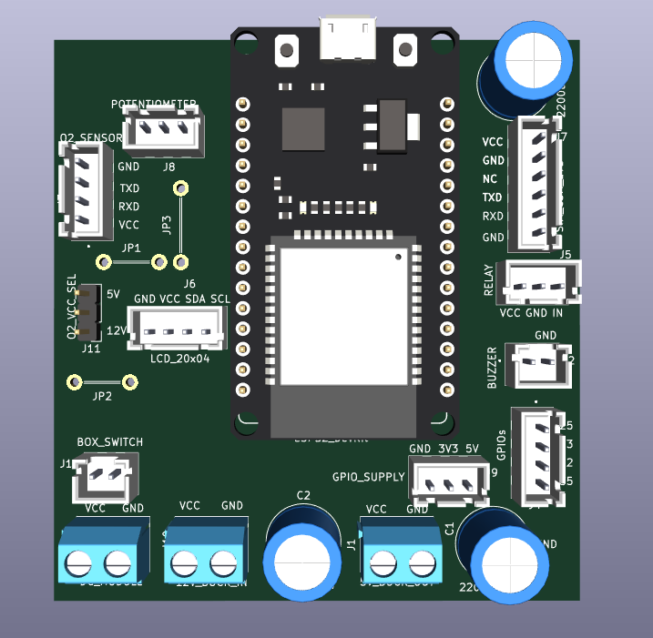
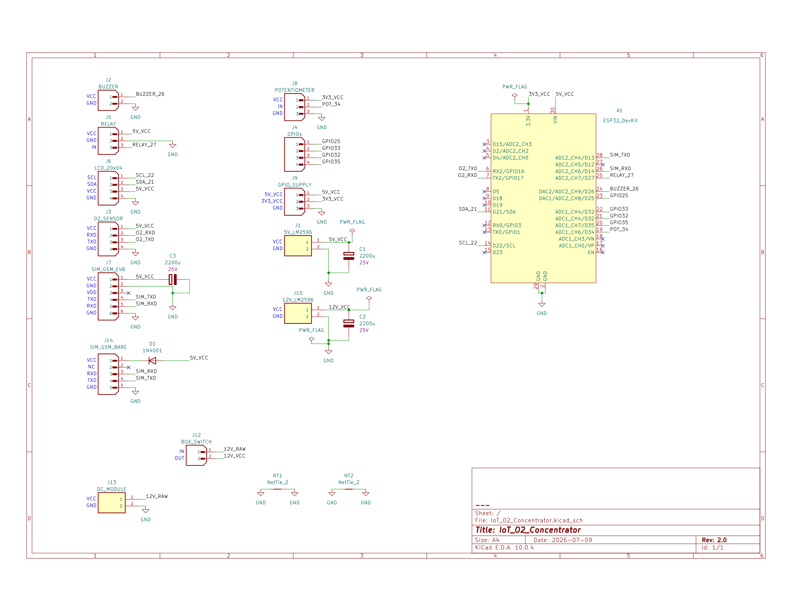
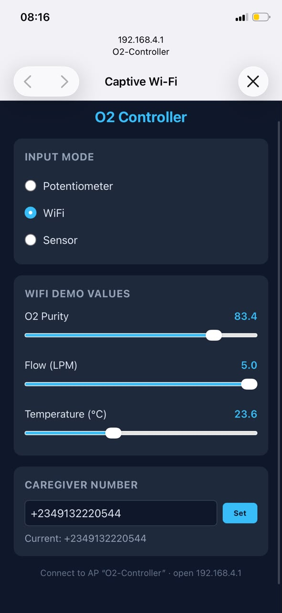
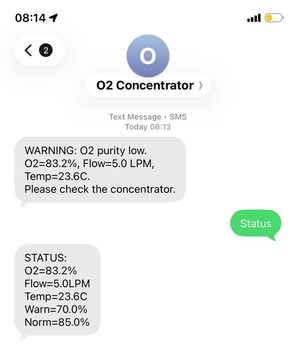

# IoT Oxygen Concentrator Integration

**Purity Monitoring, Alert System and Compressor Control**

A non-invasive integration module for PSA oxygen concentrators. The system monitors
oxygen purity on the outlet line, escalates alerts through five tiers as purity drops,
notifies a caregiver via SMS or voice call, and cuts compressor power only at true
system failure levels.

---


## What This System Does

| Feature | Description |
|---|---|
| Purity monitoring | OCS-3FL2.0 ultrasonic sensor on post-filtration outlet (UART2) |
| Local display | LCD 2004 (I2C) shows O2%, flow, temperature, status, GSM signal, uptime |
| Five-tier alerts | NORMAL → WARNING → DANGER → SEVERE → CRITICAL, each with distinct buzzer pattern and response |
| Caregiver config | Number stored in NVS flash — configurable via USB serial, SMS command, **or the web portal** |
| Three input modes | Potentiometer (demo), WiFi captive portal (demo sliders), or real Sensor (UART) |
| Boot illusion | On boot, simulates a sensor warm-up ramp until a real sensor is connected — no hardware required to demo |
| Fail-safe relay | Compressor only cuts at CRITICAL (near-ambient O2, sustained) — every other tier keeps it running while alerting |

The concentrator itself is **not modified**. All integration is external in a separate enclosure.

---

## Hardware

| Component | Role |
|---|---|
| ESP32 DevKit (standard) | Main microcontroller, 3 UARTs, WiFi AP for captive portal |
| OCS-3FL2.0 sensor | Oxygen purity, flow, temperature (UART2, 12-byte packet) |
| SIM800L GSM EVB | SMS and voice call via Nigerian GSM network (UART1) |
| LCD 2004 + I2C backpack | Local display, 4 rows |
| 5V relay module + NPN driver (BC337) | Compressor power control, active-HIGH from GPIO |
| Active buzzer (5V) | Audible alert, pattern varies by tier |
| LM2596 buck converter | 12V to 5V regulated rail |
| 12V AC-DC module | Mains AC to 12V DC from concentrator supply |
| 2200uF electrolytic caps (x3) | Bulk capacitance on 5V rail, 12V rail, and SIM800L supply |
| Potentiometer 10k | Demo sensor substitute (ADC, GPIO 34) |

Full wiring, schematic, and PCB layout are documented in `docs/`.



---

## Project Structure

```
project-root/
├── firmware/               # Arduino sketch (.ino), config.h, portal_html.h
├── hardware/                # KiCad schematic, PCB layout, Gerber files
├── docs/                    # Full project documentation, diagrams, images
├── README.md                # This file
├── SETUP.md                 # Step-by-step setup guide for Arduino IDE
└── .gitignore
```

---

## Alert Tiers

The system escalates through five tiers based on O2 purity. Only the DANGER tier
and above place a voice call; only WARNING sends SMS. **The compressor keeps running
through every tier except CRITICAL** — the design assumes a caregiver may not respond
immediately, so oxygen delivery is only stopped once purity has effectively fallen to
ambient air levels, at which point the compressor was providing no therapeutic value anyway.

| Tier | O2 Purity | Buzzer | Caregiver Contact | Relay |
|---|---|---|---|---|
| NORMAL | ≥ 85% | Silent | — | ON |
| WARNING | 70% – 85% | Single beep, 1s cycle | SMS | ON |
| DANGER | 35% – 70% | Double beep, 1s cycle | Voice call | ON |
| SEVERE | 23% – 35% | Continuous tone | Voice call | ON |
| CRITICAL | < 23% (3 consecutive readings) | Continuous tone | Voice call | **OFF** |

Thresholds are runtime-adjustable (see [Configuration](#configuration-thresholds-and-caregiver-number) below)
and persist in NVS flash. Default fallback values live in `firmware/config.h`.

All alerts are suppressed for **30 seconds after boot** to allow the sensor warm-up
and GSM network registration to settle before any buzzer, SMS, or call can fire.

---

## Input Modes

The system supports three interchangeable data sources, switchable at any time from
the web portal without reflashing:

- **Potentiometer** — a physical demo knob on GPIO 34, mapped to 21%–95.6%
- **WiFi** — connect to the device's own captive portal and drag sliders for O2, flow, and temperature
- **Sensor** *(boots here by default)* — real UART2 data from the OCS-3FL2.0. If no real sensor is connected, the system runs a realistic warm-up illusion (ramping 21% → ~92% over ~15 seconds, then settling with slight jitter) so the full alert chain can be demonstrated with no hardware attached. The moment a real sensor sends valid packets, live data takes over automatically.



*WiFi captive portal for demo input and caregiver configuration*

---

## Firmware Architecture

The firmware uses **FreeRTOS** (built into the ESP32 Arduino core — no extra install needed).
Five tasks run concurrently, sharing data through two mutex-protected resources:

| Task | Core | Responsibility |
|---|---|---|
| `sensorTask` | 0 | Reads active input mode (pot / WiFi / sensor), updates shared O2 data |
| `displayTask` | 0 | Updates all 4 rows of the LCD every 500 ms |
| `webTask` | 0 | Hosts the WiFi AP, captive portal, and DNS redirect |
| `gsmTask` | 1 | Initialises modem on boot, monitors network registration every 5s |
| `configTask` | 1 | Handles USB serial and incoming SMS configuration commands |
| `alertTask` | 1 (highest priority) | Evaluates the 5-tier state machine, drives buzzer/relay/SMS/call |

`dataMutex` protects the shared sensor reading; `modemMutex` protects all TinyGSM AT command calls,
since multiple tasks share the same SIM800L UART.

---

## Quick Start

See [`SETUP.md`](SETUP.md) for the full step-by-step setup guide.

1. Install Arduino IDE 2.x
2. Add ESP32 board support
3. Install required libraries (listed in SETUP.md — includes ESPAsyncWebServer for the portal)
4. Open `firmware/IoT_O2_Concentrator.ino`
5. Set board to **ESP32 Dev Module**, select your COM port
6. Upload

---

## Configuration: Thresholds and Caregiver Number

Three interchangeable ways to configure the system — all write to the same NVS storage:

**1. Web portal (easiest, works in any input mode)**
Connect to WiFi network `O2-Controller` (password `12345678`), a captive portal should
open automatically. Enter the caregiver number in the "Caregiver Number" card and tap **Set**.

**2. USB Serial** (115200 baud)
```
SET NUM +2348012345678
SET WARN 72
SET NORM 87
STATUS
HELP
```

**3. SMS to the device SIM**
Send the same commands as SMS text to the SIM card installed in the SIM800L EVB.
The device replies with confirmation and deletes the processed message.


*Caregiver receiving a live SMS alert*

All three methods are always available regardless of which input mode (pot/WiFi/sensor) is active.

---

## Documentation

Full design documentation is in the `docs/` folder. It covers:
- System architecture and power design
- Sensor UART protocol and 12-byte packet parsing
- Relay driver circuit (NPN, active-HIGH from GPIO)
- Five-tier alert logic and state machine
- KiCad schematic and PCB layout
- Wiring connection reference table
- Bill of Materials

---

*Project by Smart Ayodele.*
*README last updated to match firmware Rev 1.4*